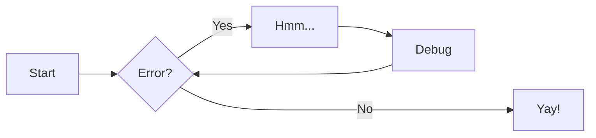

# Welcome to MkDocs

For full documentation visit [mkdocs.org](https://www.mkdocs.org).

## Commands

* `mkdocs new [dir-name]` - Create a new project.
* `mkdocs serve` - Start the live-reloading docs server.
* `mkdocs build` - Build the documentation site.
* `mkdocs -h` - Print help message and exit.

## Project layout

    mkdocs.yml    # The configuration file.
    docs/
        index.md  # The documentation homepage.
        ...       # Other markdown pages, images and other files.

??? Warning

    Lorem ipsum dolor sit amet, consectetur adipiscing elit. Nulla et euismod
    nulla. Curabitur feugiat, tortor non consequat finibus, justo purus auctor
    massa, nec semper lorem quam in massa.

1.  Vivamus id mi enim. Integer id turpis sapien. Ut condimentum lobortis
    sagittis. Aliquam purus tellus, faucibus eget urna at, iaculis venenatis
    nulla. Vivamus a pharetra leo.

    1.  Vivamus venenatis porttitor tortor sit amet rutrum. Pellentesque aliquet
        quam enim, eu volutpat urna rutrum a. Nam vehicula nunc mauris, a
        ultricies libero efficitur sed.

    2.  Morbi eget dapibus felis. Vivamus venenatis porttitor tortor sit amet
        rutrum. Pellentesque aliquet quam enim, eu volutpat urna rutrum a.

        1.  Mauris dictum mi lacus
        2.  Ut sit amet placerat ante
        3.  Suspendisse ac eros arcu

<figure markdown>

 

<figcaption markdown>Sunset over Taipei City. Credit: [Thomas Tucker](https://unsplash.com/photos/au3CYbd7vCU)</figcaption>
</figure>

<figure markdown>

{{ read_csv('test.csv') }}
